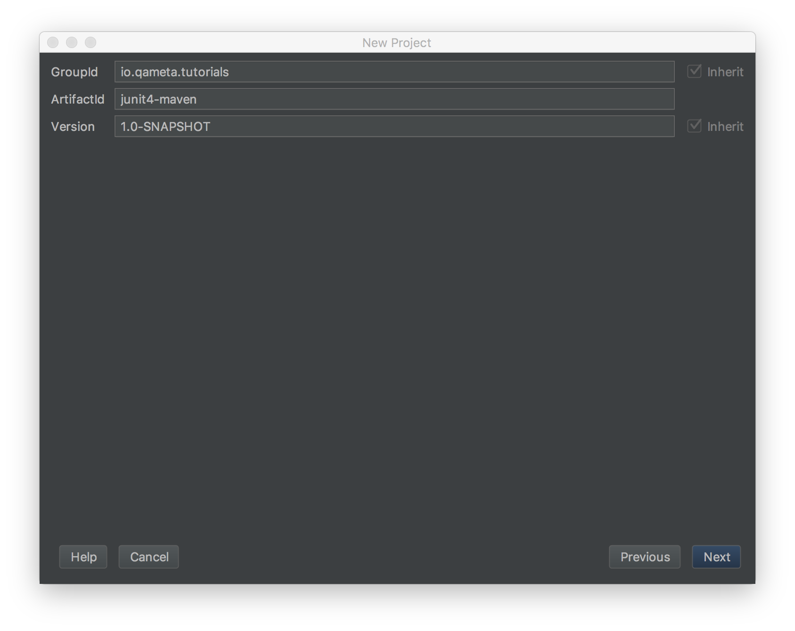

# Junit 4 + Maven + Allure adaptor

>Junit version 4.12

>Maven version 3.5.0 

## Создаём новый maven проект

```
junit4maven
```



### Добавляем Junit 4 в ваш pom.xml

```
├── pom.xml (*) here!
└── src
    ├── main
    │   ├── java
    │   └── resources
    └── test
        └── java
```

```xml
<dependencies>
    <dependency>
        <groupId>junit</groupId>
        <artifactId>junit</artifactId>
        <version>4.12</version>
    </dependency>
</dependencies>
```

### Создаём тест

```
└── src
     └── test
         └── java
             └── AllureTest.java (*) here!
```

```java
public class AllureTest {
       
   @Test
   public void simpleTest() {
       assertThat("Should be the same", "life", is("life"));
   }
       
}
```

### Настраиваем адаптер

...