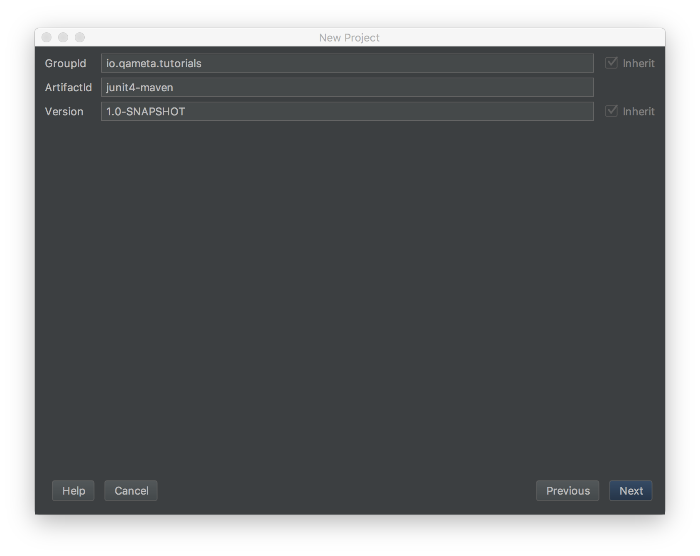

# Junit 4 + Maven + Allure client

>Junit version 4.12

>Maven version 3.5.0 

## Создаём новый maven проект

```
junit4maven
```



### Добавляем Junit 4 в ваш pom.xml

```
├── pom.xml (*) here!
└── src
    ├── main
    │   ├── java
    │   └── resources
    └── test
        └── java
```

```xml
<dependencies>
    <dependency>
        <groupId>junit</groupId>
        <artifactId>junit</artifactId>
        <version>4.12</version>
    </dependency>
</dependencies>
```

### Создаём тест

```
└── src
     └── test
         └── java
             └── AllureTest.java (*) here!
```

```java
public class AllureTest {
       
   @Test
   public void simpleTest() {
       assertThat("Should be the same", "life", is("life"));
   }
       
}
```

### Запускаем тест

В дирректории проекта 

```
> junit4maven$ ls
pom.xml         src             target
```

выполняем команду

```
> mvn clean test
INFO] Scanning for projects...
...
Tests run: 1, Failures: 0, Errors: 0, Skipped: 0

[INFO] ------------------------------------------------------------------------
[INFO] BUILD SUCCESS
[INFO] ------------------------------------------------------------------------
[INFO] Total time: 1.753 s
[INFO] Finished at: 2018-04-12T01:40:30+03:00
[INFO] Final Memory: 15M/208M
[INFO] ------------------------------------------------------------------------

```

### Проверяем что появились результаты

```
├── pom.xml
├── src
│   ├── main
│   └── test
└── target
   ├── classes
   ├── maven-status
   ├── surefire-reports (*) here!
   │   ├── TEST-io.qamets.tutorials.AllureTest.xml
   │   └── io.qamets.tutorials.AllureTest.txt
   └── test-classes
```

### Строим отчёт с помощью клиента

В дирректории проекта 

```
> junit4maven$ ls
pom.xml         src             target
```

выполняем команду

```
> allure serve target/surefire-reports/

Generating report to temp directory...
Report successfully generated to /var/folders/l8/jpj4d6rn2j1cb86x_0_xph9md26t4j/T/8304934499803059179/allure-report
Starting web server...
2018-04-12 01:49:40.311:INFO::main: Logging initialized @2319ms to org.eclipse.jetty.util.log.StdErrLog
Server started at <...>. Press <Ctrl+C> to exit

```

и смотрим на первый отчёт

