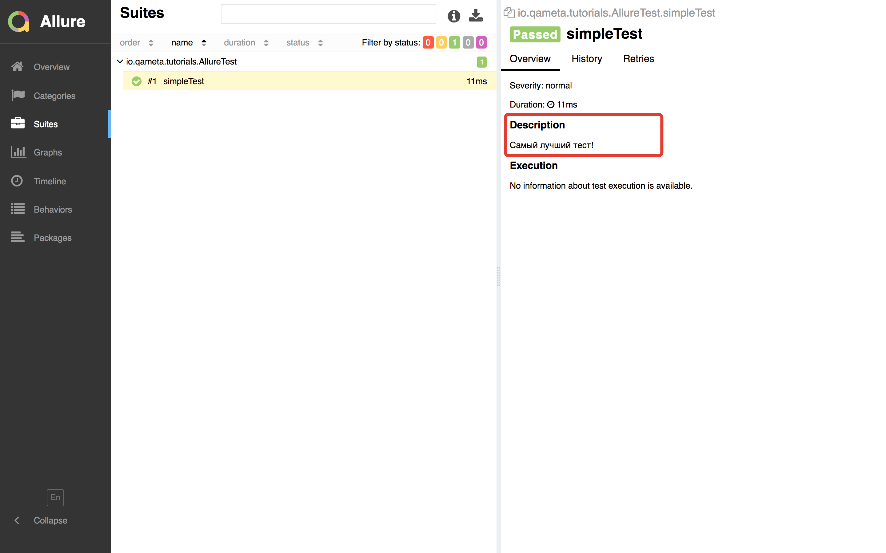

# Junit 4 + Maven + Allure adaptor + Maven Surefire

>Junit version 4.12

>Maven version 3.5.0 

>Allure version 2.6.0 

## Создаём новый maven проект

```
junit4maven
```


### Добавляем Junit 4 в ваш pom.xml

```
├── pom.xml (*) here!
└── src
    ├── main
    │   ├── java
    │   └── resources
    └── test
        └── java
```

```xml
<dependencies>
    <dependency>
        <groupId>junit</groupId>
        <artifactId>junit</artifactId>
        <version>4.12</version>
    </dependency>
</dependencies>
```

### Создаём тест

```
└── src
     └── test
         └── java
             └── AllureTest.java (*) here!
```

```java
public class AllureTest {
       
   @Test
   public void simpleTest() {
       assertThat("Should be the same", "life", is("life"));
   }
       
}
```

### Подключаем Allure

```xml
<dependency>
    <groupId>io.qameta.allure</groupId>
    <artifactId>allure-junit4</artifactId>
    <version>2.6.0</version>
</dependency>
```

Теперь мы можем пользоваться дополнительными аннотациями, которые будут видны в отчёте.
Добавим описание (`io.qameta.allure.Description`) теста:

```java
public class AllureTest {
       
   @Test
   @Description("Самый лучший тест!") // (*) here!
   public void simpleTest() {
       assertThat("Should be the same", "life", is("life"));
   }
       
}
```

### Настройка surefire плагина

По умолчанию maven запускает тесты с помощью 
[surefire](http://maven.apache.org/surefire/maven-surefire-plugin/examples/junit.html) плагина.

Его необходимо дополнительно настроить, чтобы использовать вместе с дополнительными аннотациями Allure. 
Для этого подключаем surefire в проект:

```xml
<build>
    <plugins>
        <plugin>
            <!--Surefire плагин-->
            <groupId>org.apache.maven.plugins</groupId>
            <artifactId>maven-surefire-plugin</artifactId>
            <version>2.19.1</version>
        </plugin>
    </plugins>
</build>
```

Вся дополнительная инфомация собирается с помощью [AspectJ](https://eclipse.org/aspectj/),
поэтому его необходимо запускать вместе с surefire:
 
```xml
<plugin>
    <!--Подключаем Surefire плагин--> 
    <groupId>org.apache.maven.plugins</groupId>
    <artifactId>maven-surefire-plugin</artifactId>
    <version>2.19.1</version>
    <!--Настраиваем запуск aspectj-->
    <configuration>
        <testFailureIgnore>false</testFailureIgnore>
        <argLine>
             -javaagent:"${settings.localRepository}/org/aspectj/aspectjweaver/${aspectj.version}/aspectjweaver-${aspectj.version}.jar"
        </argLine>
        <properties>
            <!--Правила для сбора информации Allure, на которые смотрит aspectj при работе-->
            <property>
                <name>listener</name>
                <value>io.qameta.allure.junit4.AllureJunit4</value>
            </property>
        </properties>
        <systemProperties>
            <!--Результаты Allure складываются в отдельную дирректорию в новом формате-->
            <property>
                <name>allure.results.directory</name>
                <value>${project.build.directory}/allure-results</value>
            </property>
        </systemProperties>
    </configuration>
    <!--Зависимость для aspectj-->
    <dependencies>
        <dependency>
            <groupId>org.aspectj</groupId>
            <artifactId>aspectjweaver</artifactId>
            <version>${aspectj.version}</version>
        </dependency>
    </dependencies>
</plugin>
```

### Запуск тестов

В дирректории проекта 

```
> junit4maven$ ls
pom.xml         src             target
```

выполняем команду

```
> mvn clean test
INFO] Scanning for projects...
...
Tests run: 1, Failures: 0, Errors: 0, Skipped: 0

[INFO] ------------------------------------------------------------------------
[INFO] BUILD SUCCESS
[INFO] ------------------------------------------------------------------------
[INFO] Total time: 1.753 s
[INFO] Finished at: 2018-04-12T01:40:30+03:00
[INFO] Final Memory: 15M/208M
[INFO] ------------------------------------------------------------------------

```

### Проверяем, что появились результаты

Появилась новая папка с результатми allure-results

```
└── target
    ├── allure-results (*) here!
    │   └──%random UUID%-result.json
    ├── classes
    ├── maven-status
    ├── surefire-reports
    └── test-classes
```

### Строим отчёт с помощью Allure клиента

В дирректории проекта 

```
> junit4maven$ ls
pom.xml         src             target
```

выполняем команду

```
> allure serve target/allure-results/

Generating report to temp directory...
Report successfully generated to /var/folders/l8/jpj4d6rn2j1cb86x_0_xph9md26t4j/T/8304934499803059179/allure-report
Starting web server...
2018-04-12 01:49:40.311:INFO::main: Logging initialized @2319ms to org.eclipse.jetty.util.log.StdErrLog
Server started at <...>. Press <Ctrl+C> to exit

```

и смотрим на первый отчёт

